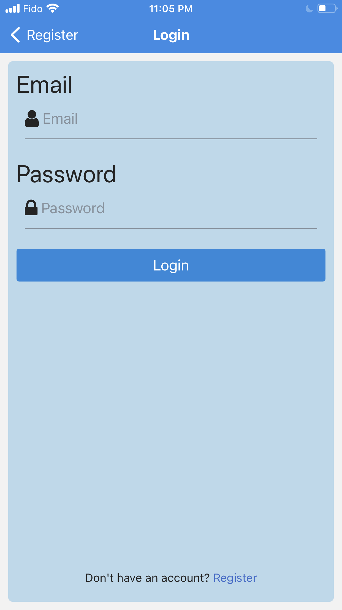
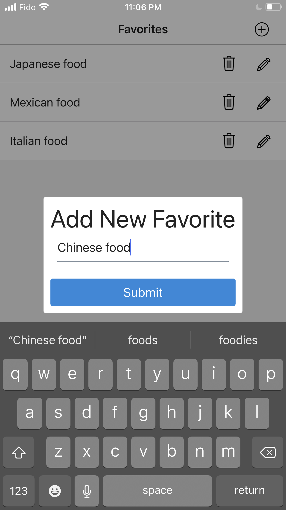
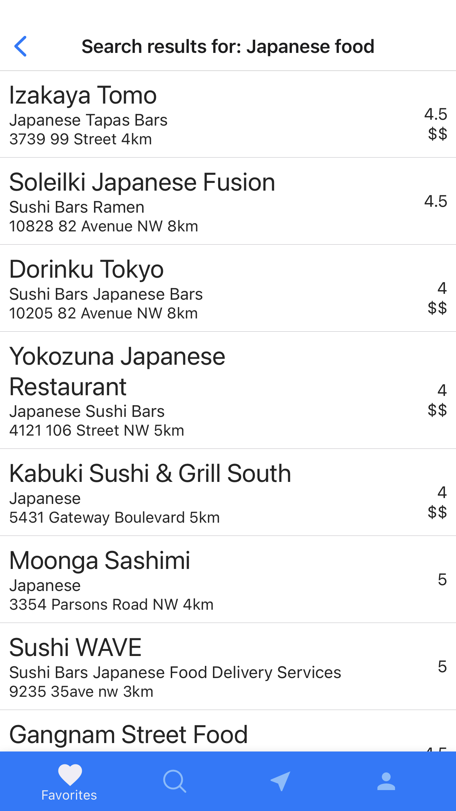
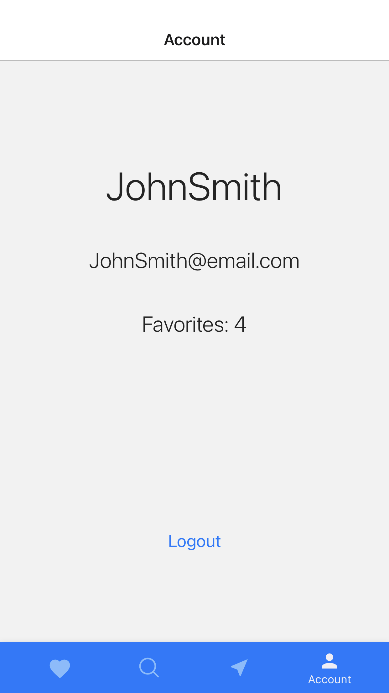
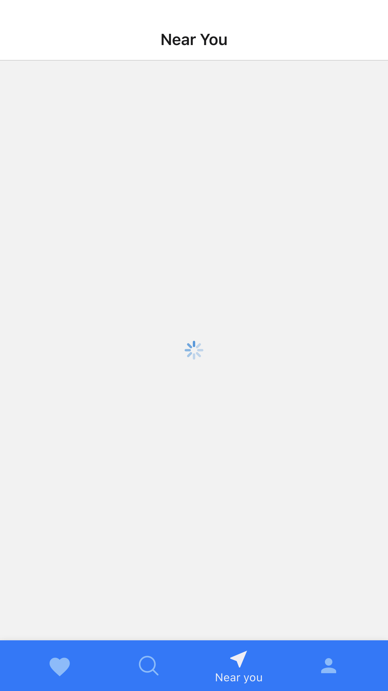
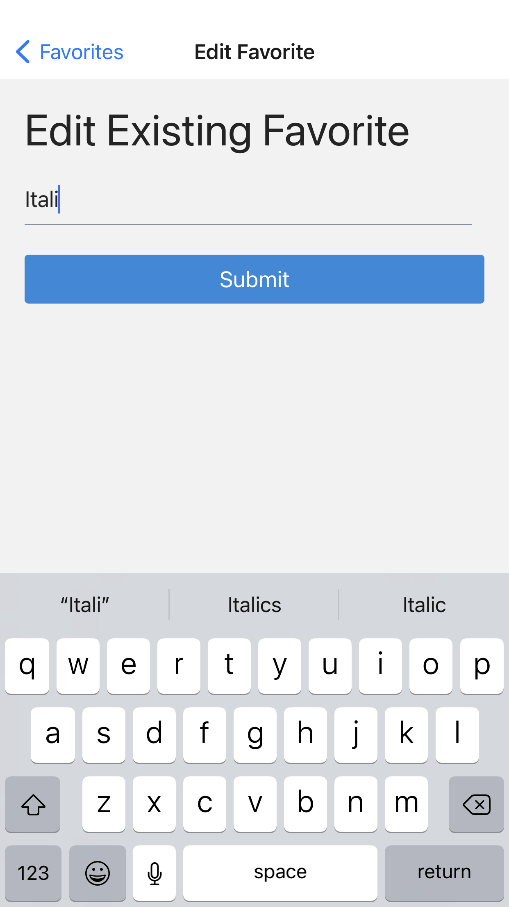
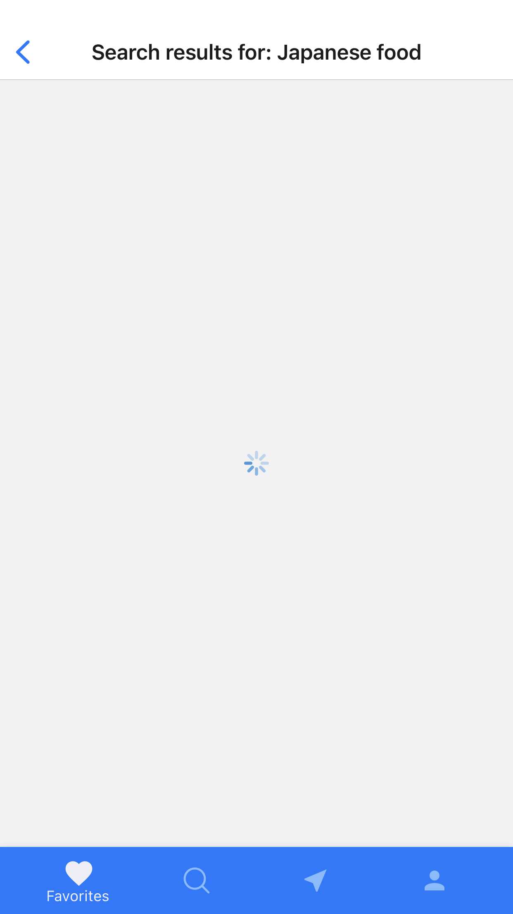

# Food Search App

-   Documentation and code for the back-end can be found [here](https://github.com/SinghGunkar/food-app-API)

## Built with

-   React Native
-   React
-   MongoDB (deployed using Digital Ocean free tier)
-   Node
-   Axios
-   Express
-   State management: redux/react-redux
-   Authentication: jwt token & bcrypt
-   Middlleware for backend security
    -   Helmet and Xss (for xss prevention)
    -   Hpp (for http param pollution)
-   Other
    -   Custom hooks for API requests
    -   Yelp API for search results
    -   Ipgeolocation API for forward geolocation
    -   Expo-location API for forward geolocation
    -   Async storage for local jwt token storage

## Usage

1.  Download zip
2.  Ensure you have expo installed `npm install --global expo-cli `
3.  Navigate to the location of the zip file, cd into zip file `cd /path/To/Zip/File`
4.  Install dependencies `npm install`
5.  Start application `expo start`
6.  Expo will launch and show a QR code in browser
7.  Scan the QR code with your phone (you will need the [Expo Go](https://expo.dev/client) app installed)

## Features

-   Authentication (login, register, logout)
-   Create new favorites for a user
-   Delete existing favorites for a user
-   Edit existing favorites for a user
-   User favorites are automatically fetched on user login
-   Authentication persistence and auto-login
-   Search for restaurants/businesses via geolocation and yelp's API
-   Get nearby food places via expo-location and yelp's API
-   Loading indicators for the search and nearby screen
-   Number of favorites for a user displayed on the account screen
-   Authentication validation with error message displayed

## Food Search App Screenshots

-   Below are some screenshots of the app (in no particular order)

    <table>
    <tr>
        <td></td>
        <td></td>
        <td></td>
    </tr>
    <tr>
        <td></td>
        <td></td>
        <td></td>
    </tr>
    <tr>
        <td></td>
        <td></td>
        <td></td>
    </tr>
    <tr>
        <td></td>
        <td></td>
        <td></td>
    </tr>
    </table>

## Key takeaway(s)

Below are some lessons I learned after completing this project

##### Problem: end point misconfiguration

##### Lesson: exhaustively test all end points from client side during developing before deploying a back-end to production

-   An end point was configured as `GET` when it should have been `POST`. However, I had already deployed my back end to production. As a result, I could not request some user data from the database using the misconfigured  endpoint. I used an alternative end point to fetch the data instead. This solved the problem, but decreased code clarity.

##### Problem: state management complexity

##### Lesson: use redux and systematically plan the react component tree prior to development

-   State and prop management (using react native) became complex as the component tree became more nested. I found myself having to pass props down through multiple components. Certain components did not have easy access to the required state variables. I was midway through development, but had to scrap the entire project and restart using redux. The redux design pattern adds structure and forces a developer to code using the redux design pattern.

##### Problem: failing to track API status

##### Lesson: always track the status of an API request and provide UI feedback

-   Failing to track API status causes problems during development and gives a poor UI experience. When chaining API requests, I needed to know that the first API request had completed before I could submit the second request. For example, fetching a user's geolocation coordinates and then searching for  restaurants based of those coordinates becomes complex if API request status(s) are not tracked. Redux's createSlice() function is a good tool for this.

*   Once a user makes an API request, always show a loading indicator and disable the user's ability to make another request if a current request is in progress.

##### Problem: separation of concerns for react components and screens

##### Lesson: components should primarily be responsible for rendering props, screens should primarily be responsible for perform side effects

-   To maximize component reusability, components should receive data and callbacks as props. Screen should perform side effects such as making API requests. If components contain logic from API requests, they become less reusable. This problem can be avoided by keeping logic for side effects outside of components.

##### Problem: FlatList component from "react-native-elements" performance

##### Lesson: components from standard library are not always optimized for performance, proceed with caution when using components from third party libraries

-   FlatList has performance issues when rendering large lists. The following [link](https://reactnative.dev/docs/optimizing-flatlist-configuration) was helpful to mitigate the problem. Don't assume that code from thrid party libraries will be performant.
