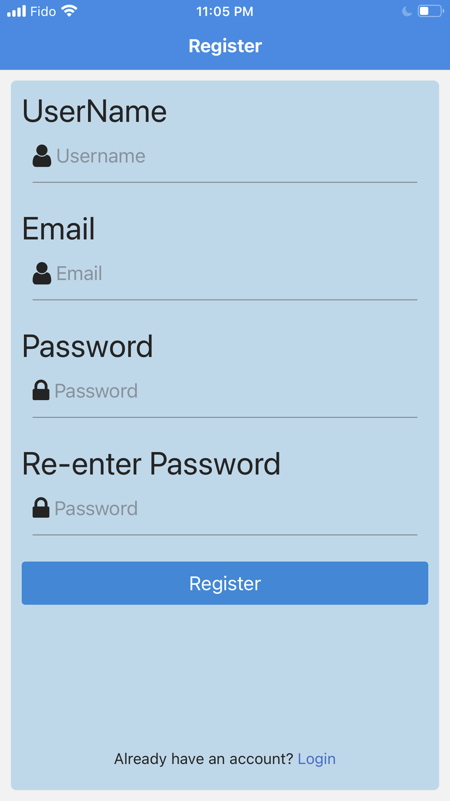

# Food Search App

-   Documentation and code for the backend can be found [here](https://github.com/SinghGunkar/food-app-API)

## Built with

-   React Native
-   React
-   MongoDB
-   Node
-   Axios
-   Express
-   State management: redux/react-redux
-   Authentication: jwt token & bcrypt
-   Middlleware for backend security
    -   helmet and xss for xss prevention
    -   hpp for http param pollution
-   Other
    -   Custom hooks for api requests
    -   Yelp api for search results
    -   Ipgeolocation api for forward geolocation
    -   Expo-location for for forward geolocation
    -   Async storage for local jwt token storage

## Usage

1.  Download zip
2.  Ensure you have expo installed `npm install --global expo-cli `
3.  Navigate to the location of the zip file, cd into zip file `cd /path/To/Zip/File`
4.  Install dependencies `npm install`
5.  Start application `expo start`
6.  Expo will launch and show QR code in browser
7.  Scan the QR code with your phone (you will need the expo go app installed)

## Food Search App Screenshots

-   Below are some screen shots of the app (in no particular order)

<table>
  <tr>
    <td></td>
    <td></td>
    <td></td>
  </tr>
  <tr>
    <td></td>
    <td></td>
    <td></td>
  </tr>
  <tr>
    <td></td>
    <td></td>
    <td></td>
  </tr>
  <tr>
    <td></td>
    <td></td>
    <td></td>
  </tr>
 </table>
